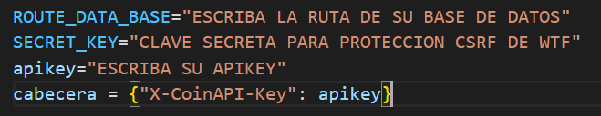
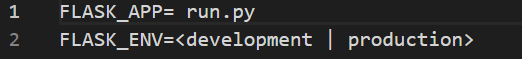

# Proyecto Final Bootcamp "Aprende a Programar desde 0" por Cristina Rodríguez
## Información General
***
A continuación, presento mi prototipo de aplicación para la consulta y compra de criptomonedas con dinero ficticio.

El balance del que dispones es indefinido y este es en euros(€). Podrás intercambiar criptos entre ellas si la moneda de origen ha sido comprada con euros previamente. 

## Instalación 
***
1. Tendrás que crear una nueva carpeta con los comandos siguentes:
``` 
cd---> para moverte dentro de las carpetas de tu ordenador
mkdir--> para crear la carpeta
cd (nombre de tu nueva carpeta para acceder a esta)
```
2. Tendrás que clonar el repositorio de GitHub para que aparezca tu terminal. Puedes hacerlo de dos formas:
```
Opción 1: Creando un nuevo repositorio en remoto en GitHub:
> git remote add origin https://github.com/Crispy96/Project.git
```
```
Opción 2 Copiandolo directamente:
> git clone https://github.com/Crispy96/Project.git
```
3. Tendrás que abrir la carpeta que acabas de crear
```
File--> Open Folder-->Tu carpeta
```
4. Deberás activar el entorno virtual en tu consolta, para ello deberás escribir en tu consola:
```
> python -m venv venv
> venv\Scripts\activate --->Windows
        --o--
> venv/bin/activate ---> Mac o Linux
```

5. En el fichero requierments.txt encontraras los programas necesarios para su ejecución. Estos los podrás installar directamente a través del siguente comando.
```
> pip install -r requierments.txt
```
## Creación de la BBDD
***
Para la creación de la base de datos deberas de consultar la carpeta **migrations** dentro de esta encontraras el archivo:
>inital.sql
En el se especifica los campos que debe de tener la BBDD.
### BBDD con SQLite
1. Ejecute el programa SQLite y selecione **Nueva base de datos**
2. Seleccione la carpeta del proyecto como lugar dónde crear la base de datos y guardela como **movimientos**
3. En creación de la tabla deberás de añadir los campos que encontrarás en archivo **inital.sql**
4. ¡LISTO! Tras guardar tu BBDD aparecerá para que puedas trabajar con ella.


## Ejecución
*** 
Tras instalar todo lo dicho arriba deberás cambiar algunos fichero y añadir otros para el correcto funcionamiento de la aplicación.
1. Tendrás que modificar el nombre del archivo config_template.py por **config.py**. También deberás de modifciar su contenido segun lo que explico más abajo.


***
Además deberás de modificar los siguentes campos:

>ROUTE_DATA_BASE--> Deberás escribir la ruta para acceder a tu base de datos

>SECRET_KEY --> Clave secreta (la que tu quieras)

>apikey --> Tendrás que escribir tu apikey, si todavía no dispones de una la puedes obtener en el siguente enlace: https://www.coinapi.io/pricing?apikey
2. El archivo .env_template deberá de ser renombrado a **.env** y modificado así:

>FLASK_ENV--> deberá modificar su contenido por **development**.
